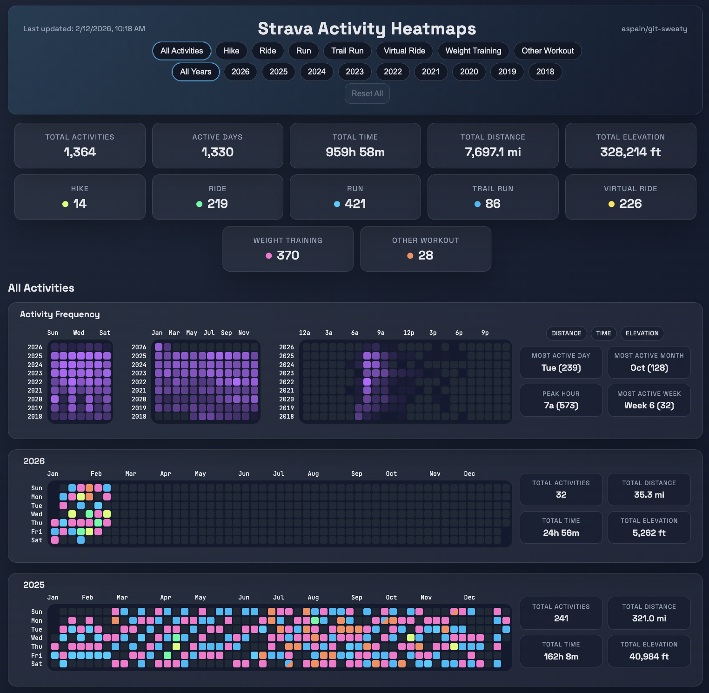

# Workout --> GitHub Heatmap Dashboard

Turn your Strava activities into GitHub-style contribution heatmaps.  
Automatically generates a free, interactive dashboard updated daily on GitHub Pages.  
**No coding required.**  

- View the Interactive [Activity Dashboard](https://aspain.github.io/git-sweaty/)
- Once setup is complete, this dashboard link will automatically update to your own GitHub Pages URL.




## Quick Start

### Option 1 (Recommended): Run the setup script

Fastest path: fork, run one script, and let it configure the repository for you.

1. Fork this repo: [Fork this repository](../../fork)
2. Clone your fork and enter it:

   ```bash
   git clone https://github.com/<your-username>/<repo-name>.git
   cd <repo-name>
   ```
3. Create a [Strava API application](https://www.strava.com/settings/api), set **Authorization Callback Domain** to `localhost`, then copy your `Client ID` and `Client Secret`.
4. Sign in to GitHub CLI:

   ```bash
   gh auth login
   ```

5. Run setup:

   ```bash
   python3 scripts/setup_auth.py
   ```

   Follow the terminal prompts and enter values for:
      - `STRAVA_CLIENT_ID`
      - `STRAVA_CLIENT_SECRET` (masked with `*` as you type/paste)
      - unit preference (`US`, `Metric`, or `Custom`)

   The setup may take several minutes to complete when run for the first time.  
   If any automation step fails, the script prints steps to remedy the failed step.  
   Once the script succeeds, it will provide the URL for your dashboard.

### Option 2: Manual setup (no local clone required)

1. Fork this repo to your account: [Fork this repository](../../fork)

2. Create a [Strava API application](https://www.strava.com/settings/api). Set **Authorization Callback Domain** to `localhost`, then copy:
   - The `Client ID` value
   - The `Client Secret` value

3. Generate a **refresh token** via OAuth (the token shown on the Strava API page often does **not** work).
   Open this URL in your browser (replace `CLIENT_ID` with the Client ID value from your Strava API application page):

   ```text
   https://www.strava.com/oauth/authorize?client_id=CLIENT_ID&response_type=code&redirect_uri=http://localhost/exchange_token&approval_prompt=force&scope=read,activity:read_all
   ```

   After approval you’ll be redirected to a `localhost` URL that won’t load. That’s expected.
   Example redirect URL:

   ```text
   http://localhost/exchange_token?state=&code=12345&scope=read,activity:read_all
   ```

   Copy the value of the `code` query parameter from the failed URL (in this example, `12345`) and exchange it.
   Run this command in a terminal app (macOS/Linux Terminal, or Windows PowerShell/Command Prompt).
   Use the `Client ID` and `Client Secret` values from your Strava API application page in Step 2.

   ```bash
   curl -X POST https://www.strava.com/oauth/token \
     -d client_id=CLIENT_ID_FROM_STEP_2 \
     -d client_secret=CLIENT_SECRET_FROM_STEP_2 \
     -d code=CODE_FROM_THE_URL_IN_STEP_3 \
     -d grant_type=authorization_code
   ```

   The response will contain several values. You'll need the `refresh_token`. For example if it shows `..."refresh_token":"ABC123"...`, copy the value `ABC123` for use in the next step.

4. Add GitHub secrets (repo → [Settings → Secrets and variables → Actions](../../settings/secrets/actions)):
   - Secret name: `STRAVA_CLIENT_ID`
      - Secret value: The `Client ID` value from step 2 above
   - Secret name: `STRAVA_CLIENT_SECRET`
      - Secret value: The `Client Secret` value from step 2 above
   - Secret name: `STRAVA_REFRESH_TOKEN`
      - Secret value: The `refresh_token` value from the step 3 OAuth exchange above

5. Enable GitHub Pages (repo → [Settings → Pages](../../settings/pages)):
   - Under **Build and deployment**, set **Source** to **GitHub Actions**.

6. Run [Sync Strava Heatmaps](../../actions/workflows/sync.yml):
   - If GitHub shows an **Enable workflows** button in [Actions](../../actions), click it first.
   - Go to [Actions](../../actions) → [Sync Strava Heatmaps](../../actions/workflows/sync.yml) → **Run workflow**.
   - The same workflow is also scheduled in `.github/workflows/sync.yml` (daily at `15:00 UTC`).

7. Open your live site at `https://<your-username>.github.io/<repo-name>/` after deploy finishes.

### Unit Preference Precedence

- Option 1 stores your unit choice in repo variables:
  - `DASHBOARD_DISTANCE_UNIT`
  - `DASHBOARD_ELEVATION_UNIT`
- When those variables are set, workflow runs use them and override `config.yaml` units.
- If those variables are unset, workflow runs use `config.yaml` units (this is the default for Option 2/manual setup).
- To switch back to `config.yaml`-only unit control, delete those two repo variables in Settings → Secrets and variables → Actions, or:

  ```bash
  gh variable delete DASHBOARD_DISTANCE_UNIT
  gh variable delete DASHBOARD_ELEVATION_UNIT
  ```

Both options run the same workflow, which will:
- restore persisted state from the `dashboard-data` branch (if present)
- sync raw activities into `activities/raw/` (local-only; not committed)
- normalize + merge into `data/activities_normalized.json` (persisted history)
- aggregate into `data/daily_aggregates.json`
- build `site/data.json`
- commit generated outputs to `dashboard-data` (not `main`)

## Updating Your Repository

- To pull in new updates and features from the original repo, use GitHub's **Sync fork** button on your fork's `main` branch.
- Strava activity data is stored on a dedicated `dashboard-data` branch and deployed from there, so generated outputs do not need to be committed on `main`.
- `main` is intentionally kept free of generated `data/` and `site/data.json` artifacts so fork sync stays cleaner.
- After syncing, run [Sync Strava Heatmaps](../../actions/workflows/sync.yml) if you want your dashboard refreshed immediately.

## Sport Type Note

By default, all documented Strava `SportType` values are included automatically when you run the workflow.
Normalization prefers `sport_type` and falls back to `type` when `sport_type` is unavailable.
Default config keeps Strava names as-is (no grouping buckets or alias remaps).
Strava's legacy `ActivityType` (`type`) is used only as a compatibility fallback when `sport_type` is missing.

To narrow the dashboard to specific sport types:
1. Edit [`config.yaml`](config.yaml) in your fork.
2. Set `activities.include_all_types: false`.
3. Set `activities.types` to only the `SportType` values you want.
4. Run [Sync Strava Heatmaps](../../actions/workflows/sync.yml) again.

If you want "include everything except a few", keep `include_all_types: true` and set `activities.exclude_types`.

Example:

```yaml
activities:
  include_all_types: false
  types:
    - Run
    - Ride
    - WeightTraining
```

## Configuration (Optional)

Everything in this section is optional. Defaults work without changes.
Base settings live in `config.yaml`.

Key options:
- `sync.start_date` (optional `YYYY-MM-DD` lower bound for history)
- `sync.lookback_years` (optional rolling lower bound; used only when `sync.start_date` is unset)
- `sync.recent_days` (sync recent activities even while backfilling)
- `sync.resume_backfill` (persist cursor to continue older pages across days)
- `sync.prune_deleted` (remove local activities no longer returned by Strava in the current sync scope)
- `activities.types` (featured/allowed Strava `SportType` values shown first in UI; key name is historical)
- `activities.include_all_types` (when `true`, include all seen sport types; when `false`, include only `activities.types`)
- `activities.exclude_types` (optional `SportType` names to exclude without disabling inclusion of future new types)
- `activities.group_other_types` (when `true`, allow non-Strava grouping buckets like `WaterSports`; default `false`)
- `activities.other_bucket` (fallback group name when no smart match is found)
- `activities.group_aliases` (optional explicit map of a raw/canonical type to a group)
- `activities.type_aliases` (optional map from raw Strava `sport_type`/`type` values to canonical names)
- `units.distance` (`mi` or `km`)
- `units.elevation` (`ft` or `m`)
- `rate_limits.*` (free Strava API throttling caps)

## Notes

- Raw activities are stored locally for processing but are not committed (`activities/raw/` is ignored). This prevents publishing detailed per-activity payloads and GPS location traces.
- If neither `sync.start_date` nor `sync.lookback_years` is set, sync backfills all available Strava history.
- On first run for a new athlete, the workflow auto-resets persisted outputs (`data/*.json`, `site/data.json`) on `dashboard-data` to avoid mixing data across forks. A fingerprint-only file is stored at `data/athletes.json` and does not include athlete IDs or profile data.
- The sync script rate-limits to free Strava API caps (200 overall / 15 min, 2,000 overall daily; 100 read / 15 min, 1,000 read daily). The cursor is stored in `data/backfill_state.json` and resumes automatically. Once backfill is complete, only the recent sync runs.
- Manual workflow runs include a `full_backfill` toggle that clears persisted pipeline outputs and `data/backfill_state.json` before syncing.
- The GitHub Pages site is optimized for responsive desktop/mobile viewing.
